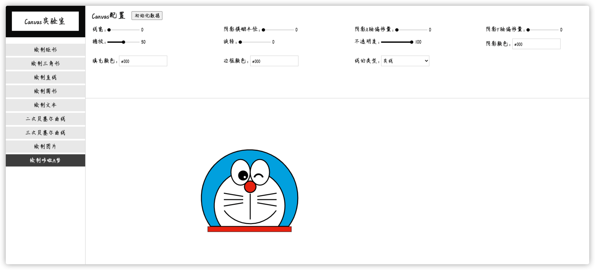

# Canvas实验室
效果图如下：

用canvas实现一些功能，可以通过配置项进行操作，分为通用类、文本类和图片类如：   
#### 通用类：
- [x] 线宽
- [x] 阴影模糊半径
- [x] 阴影X轴偏移量
- [x] 阴影Y轴偏移量
- [x] 缩放
- [x] 旋转
- [x] 不透明度
- [x] 阴影颜色
- [x] 填充颜色
- [x] 边框颜色
- [x] 线的类型
#### 文本类：
- [x] 文本内容
- [x] 字体大小
- [x] 对齐方式
- [x] 基线对齐
- [x] 文本方向
#### 图片类：
- [x] 图片地址
- [x] 切片X
- [x] 切片Y
- [x] 原点坐标X
- [x] 原点坐标Y

##实现的功能有：
- [x] 绘制矩形
- [x] 绘制三角形
- [x] 绘制直线
- [x] 绘制圆形
- [x] 绘制文本
- [x] 绘制二次贝塞尔曲线
- [x] 绘制三次贝塞尔曲线
- [x] 绘制图片
- [x] 绘制哆啦A梦